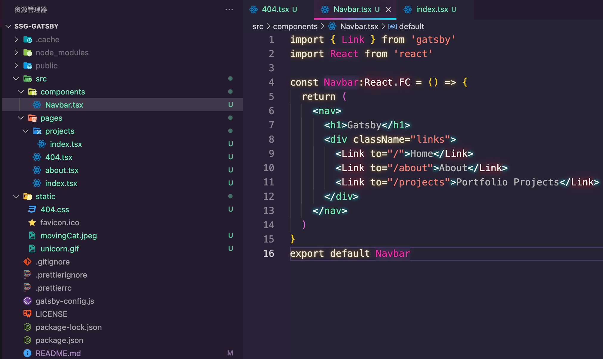
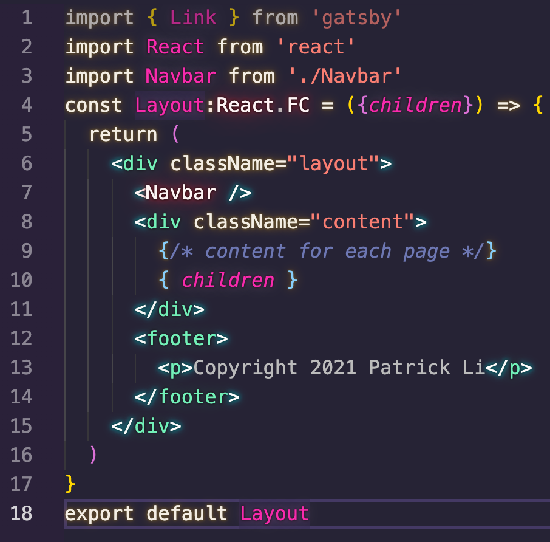
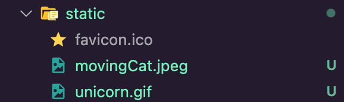
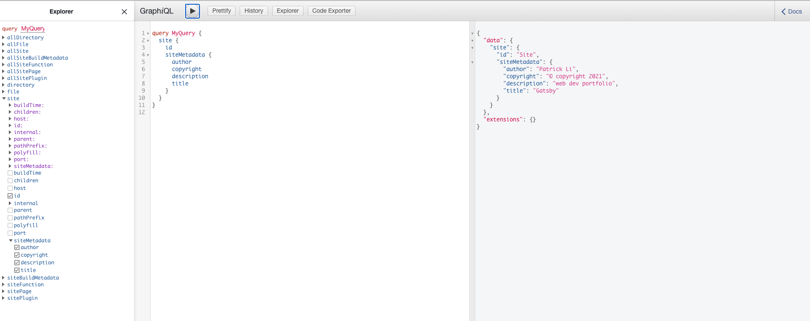
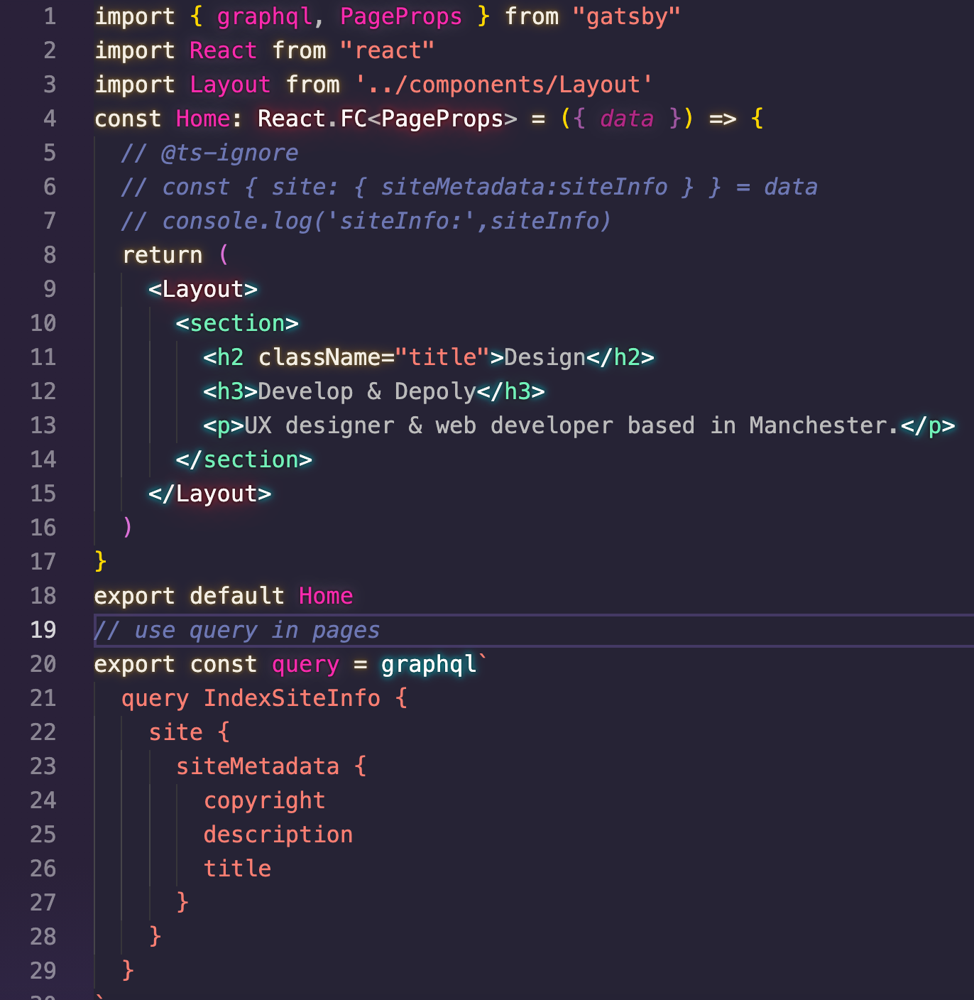
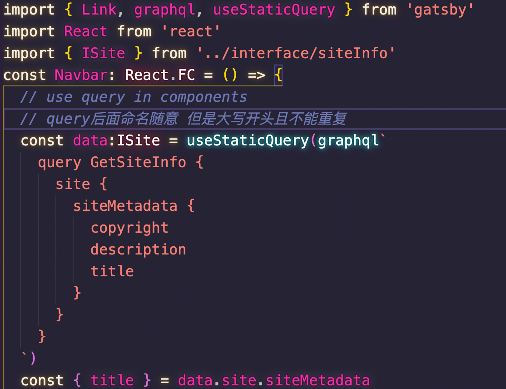

<!-- AUTO-GENERATED-CONTENT:START (STARTER) -->
<p align="center">
  <a href="https://www.gatsbyjs.com">
    
  </a>
</p>
<h1 align="center">
  Gatsby's hello-world starter
</h1>

Kick off your project with this hello-world boilerplate. This starter ships with the main Gatsby configuration files you might need to get up and running blazing fast with the blazing fast app generator for React.

_Have another more specific idea? You may want to check out our vibrant collection of [official and community-created starters](https://www.gatsbyjs.com/docs/gatsby-starters/)._

## 🚀 Quick start

1.  **Create a Gatsby site.**

    Use the Gatsby CLI ([install instructions](https://www.gatsbyjs.com/docs/tutorial/part-0/#gatsby-cli)) to create a new site, specifying the hello-world starter.

    ```shell
    # create a new Gatsby site using the hello-world starter
    gatsby new my-hello-world-starter https://github.com/gatsbyjs/gatsby-starter-hello-world
    ```

1.  **Start developing.**

    Navigate into your new site’s directory and start it up.

    ```shell
    cd my-hello-world-starter/
    gatsby develop
    ```

1.  **Open the source code and start editing!**

    Your site is now running at `http://localhost:8000`!

    _Note: You'll also see a second link: _`http://localhost:8000/___graphql`_. This is a tool you can use to experiment with querying your data. Learn more about using this tool in the [Gatsby tutorial](https://www.gatsbyjs.com/tutorial/part-five/#introducing-graphiql)._

    Open the `my-hello-world-starter` directory in your code editor of choice and edit `src/pages/index.js`. Save your changes and the browser will update in real time!

## 🚀 Quick start (Gatsby Cloud)

Deploy this starter with one click on [Gatsby Cloud](https://www.gatsbyjs.com/cloud/):

[](https://www.gatsbyjs.com/dashboard/deploynow?url=https://github.com/gatsbyjs/gatsby-starter-hello-world)

## 🧐 What's inside?

A quick look at the top-level files and directories you'll see in a Gatsby project.

    .
    ├── node_modules
    ├── src
    ├── .gitignore
    ├── .prettierrc
    ├── gatsby-browser.js
    ├── gatsby-config.js
    ├── gatsby-node.js
    ├── gatsby-ssr.js
    ├── LICENSE
    ├── package-lock.json
    ├── package.json
    └── README.md

1.  **`/node_modules`**: This directory contains all of the modules of code that your project depends on (npm packages) are automatically installed.

2.  **`/src`**: This directory will contain all of the code related to what you will see on the front-end of your site (what you see in the browser) such as your site header or a page template. `src` is a convention for “source code”.

3.  **`.gitignore`**: This file tells git which files it should not track / not maintain a version history for.

4.  **`.prettierrc`**: This is a configuration file for [Prettier](https://prettier.io/). Prettier is a tool to help keep the formatting of your code consistent.

5.  **`gatsby-browser.js`**: This file is where Gatsby expects to find any usage of the [Gatsby browser APIs](https://www.gatsbyjs.com/docs/reference/config-files/gatsby-browser/) (if any). These allow customization/extension of default Gatsby settings affecting the browser.

6.  **`gatsby-config.js`**: This is the main configuration file for a Gatsby site. This is where you can specify information about your site (metadata) like the site title and description, which Gatsby plugins you’d like to include, etc. (Check out the [config docs](https://www.gatsbyjs.com/docs/reference/config-files/gatsby-config/) for more detail).

7.  **`gatsby-node.js`**: This file is where Gatsby expects to find any usage of the [Gatsby Node APIs](https://www.gatsbyjs.com/docs/reference/config-files/gatsby-node/) (if any). These allow customization/extension of default Gatsby settings affecting pieces of the site build process.

8.  **`gatsby-ssr.js`**: This file is where Gatsby expects to find any usage of the [Gatsby server-side rendering APIs](https://www.gatsbyjs.com/docs/reference/config-files/gatsby-ssr/) (if any). These allow customization of default Gatsby settings affecting server-side rendering.

9.  **`LICENSE`**: This Gatsby starter is licensed under the 0BSD license. This means that you can see this file as a placeholder and replace it with your own license.

10. **`package-lock.json`** (See `package.json` below, first). This is an automatically generated file based on the exact versions of your npm dependencies that were installed for your project. **(You won’t change this file directly).**

11. **`package.json`**: A manifest file for Node.js projects, which includes things like metadata (the project’s name, author, etc). This manifest is how npm knows which packages to install for your project.

12. **`README.md`**: A text file containing useful reference information about your project.

## 🎓 Learning Gatsby

Looking for more guidance? Full documentation for Gatsby lives [on the website](https://www.gatsbyjs.com/). Here are some places to start:

- **For most developers, we recommend starting with our [in-depth tutorial for creating a site with Gatsby](https://www.gatsbyjs.com/tutorial/).** It starts with zero assumptions about your level of ability and walks through every step of the process.

- **To dive straight into code samples, head [to our documentation](https://www.gatsbyjs.com/docs/).** In particular, check out the _Guides_, _API Reference_, and _Advanced Tutorials_ sections in the sidebar.

## 💫 Deploy

[Build, Deploy, and Host On The Only Cloud Built For Gatsby](https://www.gatsbyjs.com/products/cloud/)

Gatsby Cloud is an end-to-end cloud platform specifically built for the Gatsby framework that combines a modern developer experience with an optimized, global edge network.

<!-- AUTO-GENERATED-CONTENT:END -->

## :hatching_chick:Routes

**Q: how do i create a page in Gatsby**

**A:you can create pages in `src/pages` **

**for example i create a file named `about.tsx` in `src/pages` and now all i have to do is write code use React syntax while i saving the file console terminal printing logs so i can see project's status When u see the status is :white_check_mark: success by now u can open the browser and input `localhost:8000/about` and  u can see the page  Route will generated automatically by Gatsby**

yep Gatsby support **js、jsx、ts、tsx **that's impressive

**Q: what if i want create a page and browse it in `localhost:8000/projects/test` ?**

**A: well to make sure that u need to create a folder in `src/pages` named projects and create a file named `test.tsx` in it and do the same thing u just did u can browse this page at `localhost:8000/projects/test`**

**Q: how to browse `localhost:8000/projects` and see the correspond page?**

**A: and u can browse by create index.tsx in this folder Gatsby will regard it's a root page for `localhost:8000/projects`**

try this right now make sure you known well about this part

## :no_entry_sign: Create a 404 page

it's easy to create a 404 page in Gatsby

Just create a `404.tsx` in `src/pages` and coding your own 404 pages 

or you can set a redirect when user enter a nonexistent page it'll automate redirect to somewhere exist like HomePage etc.

## :link:About NavBar

read here i believe you already have some basic acknowledge about Gatsby from now on we'll create a NavBar to link some pages 

and of course we won't create NavBar in `src/pages` cause NavBar isn't a page it might be a component that every page needed

i will create a new folder in our source folder `src` named components you can call it whatever you want but i call it components just my preference

i gonna put all the non-page things here

for components i usually name it start with capital letter but pages don't

usually u think i will use <a></a> to link but that's not how it work in react 

so we'll use link in react-router it won't send extra request to the server and we want all routing is done in browser 

i've already create a Navbar component below so as you can see because we didn't install react-router or react-router-dom 

so we gonna use Link in Gatsby

what's remain to do is our Navbar constructure 



so we've create our Navbar component now we need nest our Navbar into our pages 

i will start with HomePage first of all we import Navbar from where it belong and use it that it

we head to HomePage and we can see the Navbar is here i click one of them it worked

## :heavy_exclamation_mark:Layout 

if we want use Navbar that mains we need to import it where we need that's quite Inefficient so what we need is a layout component which incorporates 

the Navbar the Footer and anything else that consistent across all pages and then just wrap all of the different pages with thath single layout component 

usually when you create a website there's some element on your site that might be on every signle page

so we gonna create a layout component for our Navbar at the top and the Footer at the bottom and we'll wrap all of our different

pages 



then you can import this Layout where you need it like HomePage、About、Projects

## :copyright:Style

of course you can use CSS in Gatsby it's supported naturally but what if i want use like LESS or SCSS pre-process

i'll start with SCSS

doc: https://github.com/gatsbyjs/gatsby/tree/master/packages/gatsby-plugin-sass

first `npm install sass gatsby-plugin-sass`

and jump to gatsby-config.js and add plugin 

```js
plugins: [`gatsby-plugin-sass`]
```

and that's it now you can use SCSS in project

but in this situation we'll use a brand new framework [**tailwindcss**](https://tailwindcss.com/)

to start with that we need some setting [tailwindcssWithGatsby](https://www.tailwindcss.cn/docs/guides/gatsby)

follow the instruction

## :floppy_disk:Static file

sometime we want use some static file like images、CSS sheets etc... as we see there's a folder named `static` in your project and a icon inside already anything you want to be made avalible as a static asset to the browser you should put in `static` folder if you create a folder in `src` it won't be public for browser anything we put in `static` folder will automatically put in `public` folder so now i put a image named `unicon.gif` and check the public folder `unicorn.gif` already inside



and we go to the browser and input `localhost:8000/unicorn.gif` it will directly show this image and won't get error like 404

you could put anything static file in `static` folder JS、CSS、TS etc...

but the file you put in `static` folder won't be optimized or minify so it will slow your application down

https://www.gatsbyjs.cn/docs/static-folder/

## :grey_question:Query

Gatsby provide multiple ways to query data

 **example**

i will create some siteInfo 

```
/**
	gatsby-config.js
 */
module.exports = {
  /* Your site config here */
  plugins: [],
  siteMetadata: {
    title: 'Gatsby',
    description: 'web dev portfolio',
    author: 'Patrick Li',
    copyright: `©️ copyright ${new Date().getFullYear()}`,
  }
}

```

remember restart the gatsby server everytime you've changed the **gatsby-config.js** file

and we can see terminal print 

```zsh
You can now view gatsby-starter-hello-world in the browser.
⠀
  http://localhost:8000/
⠀
View GraphiQL, an in-browser IDE, to explore your site's data and schema
⠀
  http://localhost:8000/___graphql
```

check the second site 



there's a option under project tree named site and we can see `author、copyright、description、title` we've just create 

paste content in middle area go down to our project 

### query in pages

first import **praphql、PageProps** in from gatsby

**praphql for query PageProps for typeScript**



export a query and write like top of it 

there's two rule for the name after query 

1. start with uppercase letter
2. don't name query duplicate in project

### query in components

there's a litter different between components and pages of how we use query in 



**useStaticQuery** this API is what we need

## :heavy_check_mark:Plugin

Gatsby allow multiple plugin to use such as transformer-markdown file-system project deploy etc..

you can check it down below 

[Plugins](https://www.gatsbyjs.com/plugins)

### image optimize

[tutorials](https://www.youtube.com/watch?v=rXrdMS5_Afs&list=PL4cUxeGkcC9hw1g77I35ZivVLe8k2nvjB&index=16)

